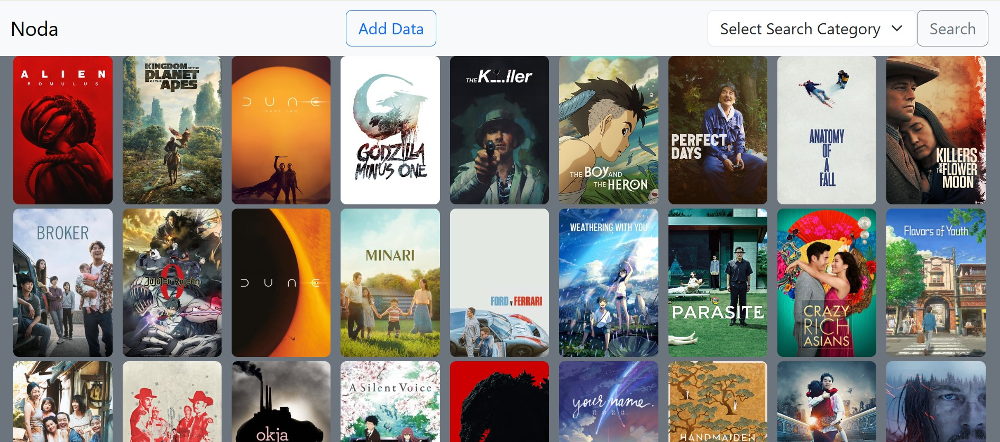

# Noda - A Letterboxd Clone

Welcome to Noda, a clone of the popular movie cataloging service [Letterboxd](https://letterboxd.com/),
with data collected from my [letterboxdWebScraper](https://github.com/noahwenck/letterboxdWebScraper).



## Tech Stack
- **Languages**: Java, JavaScript, Python (letterboxdWebScraper)
- **Frameworks**: Spring Boot, Bootstrap, Flask (letterboxdWebScraper)
- **Misc**: MariaDB, Docker, Gradle

## Installation

1. Clone the repo
   ```sh
   git clone git@github.com:noahwenck/noda.git
   ```
2. Ensure the following dependencies are installed:
   - [Java](https://www.oracle.com/java/technologies/downloads/?er=221886) (should work just as well with Java 18 or newer)
   - [Docker Desktop](https://www.docker.com/)
   - [Gradle](https://gradle.org/)
3. Run a Gradle build:
   ```sh
   ./gradlew build
   ```

## Running

1. From the Start up your MariaDB pod by running the following command from the project's directory:
   ```
   docker compose up
   ```
2. To start the application, you can either
   1. Run the NodaApplication run configuration in your IDE
   2. Run:
        ```
        ./gradlew bootRun
        ```
3. To start up the Noda Flask App (necessary to collect data), follow the 
[steps found here](https://github.com/noahwenck/letterboxdWebScraper?tab=readme-ov-file#connect-to-noda).
4. Navigate to [localhost:8080](http://localhost:8080).